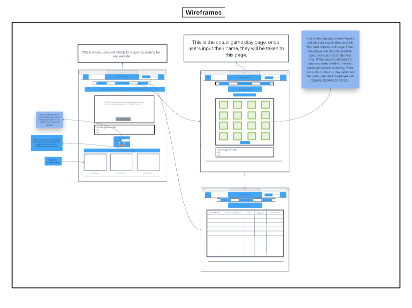
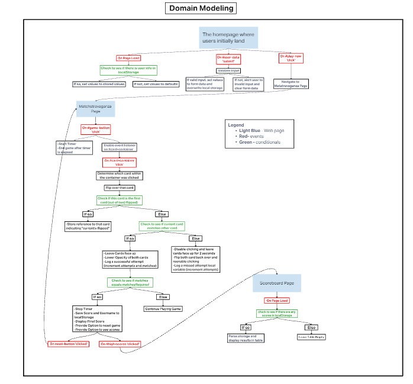

# memory-game

## Authors

* Brady Davenport
* Cheri Hodge
* Ben Small
* Elizabeth Hammes

## Memory game description

### Summary of project

#### A memory matching game using cards

A simple matching game where players click on 'cards' trying to match the images on back side of them.

#### What problem or pain point does it solve?

This game will provide memory improvement in the form of an entertaining game.

#### Minimum Viable Product (MVP) definition

* A home page with a username input form
* Game
  * A gameplay page with a 4x4 grid of clickable 'cards'
  * Two matching cards stay on page to indicate a match
  * If/when all matches are made, score is logged
* User scores persist in local storage
* A high scores page that displayed persisted score data
* CSS
  * Game centered in page
  * margins between cards
  * Same color scheme on all pages - appealing contrast
  * Same header/footer layout on all pages

